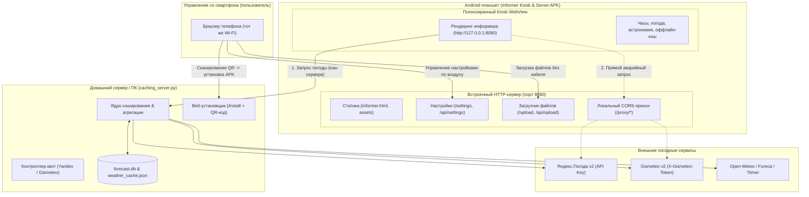
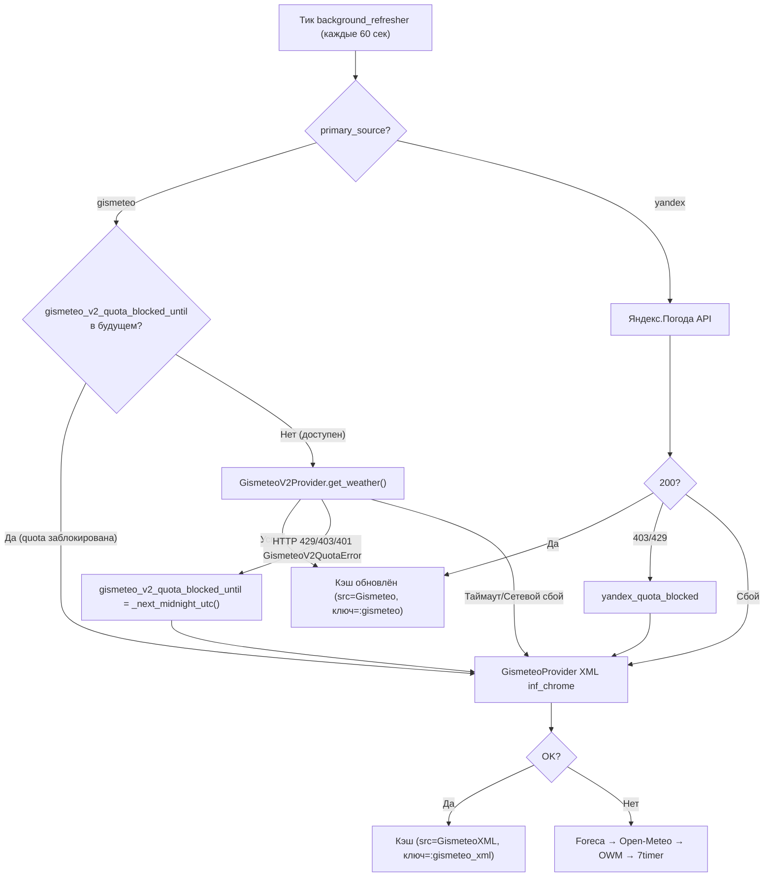

# Архитектурное предложение (Architecture Proposal)
## Weather Informer: Встроенный сервер на планшете, Zero-ADB деплой и официальный API Gismeteo

**Дата:** 01.10.2026  
**Статус:** На архитектурном ревью  
**Проект:** `/home/dmazur/services/weather-informer`

---

## 1. Введение и цели модернизации

Погодный информер успешно работает на парке старых планшетов (Digma Plane 7514S, Oysters T74HMi, 4GOOD Light AT200, IRBIS TZ175 под управлением Android 6.0–7.0).
Однако в текущей эксплуатации выявлены три ключевых вызова:

1. **Ограничения `file:///` и зависимость от root-прав**:
   - Страница информера читается через `file:///sdcard/Download/informer.html`.
   - Это накладывает жёсткие ограничения безопасности WebKit/Chromium: блокировка кросс-доменных AJAX-запросов к внешним API, проблемы с чтением соседних файлов (`config.json`), нестабильность `localStorage`.
   - Для обхода приходилось через root (`su`) инъецировать параметры `allow_universal_access_from_file_urls` в закрытый каталог `/data/data/uk.nktnet.webviewkiosk/shared_prefs/user_settings.xml`.
2. **Сложный процесс развёртывания и обновлений**:
   - Подключение новых планшетов или обновление верстки требует ПК с Linux, включения ADB (по USB или WiFi на порту 5555), наличия root-прав и запуска консольных bash-скриптов.
   - Пользователь хочет предельно простую схему: «развернуть хоть с соседнего телефона, без ADB».
3. **Лимиты погодных API и появление ключа Gismeteo**:
   - Бесплатный Яндекс ограничен 30 запросами в день.
   - Пользователю выдан официальный API-ключ Gismeteo (`X-Gismeteo-Token`), у которого также есть суточная квота.
   - Требуется реализовать для Gismeteo двухуровневую архитектуру (как для Яндекса): кэширование на домашнем сервере для защиты квоты + возможность прямого подключения с клиента.

---

## 2. Целевая архитектура системы



---

## 3. Архитектурное решение компонента 1: Встроенный веб-сервер на планшете

### 3.1. Техническая реализация сервера
Сервер реализуется внутри Android-приложения в виде Foreground Service (или фонового потока Activity), работающего на порту `8080` (настраиваемо):
- **Стек**: легковесный встроенный HTTP-сервер на базе **NanoHTTPD (2.3.1)** либо компактный `ServerSocket` (пакет `com.sun.net.httpserver` отсутствует в Android runtime и не может использоваться).
- **Надежность и жизненный цикл**:
  - Сервер работает как **Foreground Service** (`startForeground()` с постоянным низкоприоритетным уведомлением), что защищает его от вытеснения подсистемой Android LowMemoryKiller (LMK) на устройствах с 1 ГБ RAM.
  - Удержание сети и CPU: `PowerManager.PARTIAL_WAKE_LOCK` и `WifiManager.createWifiLock(WifiManager.WIFI_MODE_FULL_HIGH_PERF)` для предотвращения засыпания сокетов подсистемами DuraSpeed (MediaTek) и Doze Mode.
- **Потребление ресурсов**: < 10–15 МБ RAM, 0% CPU в режиме ожидания (критично для старых планшетов с 1 ГБ RAM на MediaTek/Allwinner).
- **Сетевой интерфейс**: слушает `0.0.0.0:8080` (доступен как для внутреннего WebView `127.0.0.1:8080`, так и для внешних устройств в домашней Wi-Fi сети `192.168.1.X:8080`).
- **Безопасность загрузки файлов (`/api/upload`)**:
  - Защита от Path Traversal: санитизация имени через `new File(name).getName()`, проверка канонического пути `getCanonicalPath().startsWith(baseDir.getCanonicalPath())`.
  - Белый список типов: строго веб-контент (`.html`, `.json`, `.js`, `.css`, `.png`, `.svg`), лимит размера 5 МБ. Запрет на запись исполняемых файлов.
- **Безопасность прокси (`/proxy/weather`)**:
  - Защита от Open SSRF: жесткий белый список разрешенных погодных доменов (`api.gismeteo.net`, `api.weather.yandex.ru`, `api.open-meteo.com`).

### 3.2. Спецификация эндпоинтов сервера

| Метод | Путь | Назначение | Описание |
|---|---|---|---|
| `GET` | `/` или `/informer.html` | Отображение информера | Отдаёт HTML-интерфейс часов и погоды. Приоритет: файл из `/sdcard/Download/informer/` (если пользователь загрузил свой), иначе встроенный fallback из `assets/`. |
| `GET` | `/jquery.min.js`, `/assets/*` | Статические ресурсы | Скрипты, стили, SVG-иконки, шрифты. |
| `GET` | `/settings` | Веб-интерфейс настроек | Адаптивная мобильная HTML-страница (Mobile-first) для конфигурирования информера со смартфона. |
| `GET` | `/api/settings` | Получение конфигурации | Возвращает JSON текущих настроек (`config.json`). Чувствительные ключи маскируются для безопасности. |
| `POST` | `/api/settings` | Сохранение конфигурации | Принимает JSON, валидирует поля, сохраняет в `config.json`, уведомляет Kiosk WebView о необходимости применить настройки без перезапуска приложения. |
| `GET` | `/upload` | Веб-интерфейс загрузчика | Страница с Drag-and-Drop зоной для выбора и загрузки файлов на планшет. |
| `POST` | `/api/upload` | Загрузка файлов (Multipart) | Принимает файлы (например, обновленный `informer.html`), сохраняет их в рабочую директорию, перезагружает WebView. |
| `GET` | `/proxy/weather` | Локальный CORS-прокси | Позволяет WebView делать прямые запросы к Gismeteo или Яндекс без блокировок браузера по CORS. |
| `GET` | `/health` | Диагностика | Возвращает статус сервера, uptime, заряд батареи, температуру устройства и уровень Wi-Fi сигнала. |

### 3.3. Веб-интерфейс настроек (`/settings`)
Интерфейс содержит аккуратные блоки управления:
1. **Геолокация**:
   - Поля `Широта (lat)` и `Долгота (lon)`.
   - Поле поиска города с автодополнением (использует проверенный серверный эндпоинт Nominatim `/geocode`, так как браузеры смартфонов блокируют HTML5 Geolocation на HTTP IP-адресах).
2. **Источники погоды**:
   - Основной источник (`primary_source`): выпадающий список (`Яндекс.Погода`, `Gismeteo (официальный API)`, `Локальный кэширующий сервер`).
   - Поля ввода API-ключей: `Ключ Яндекс`, `Токен Gismeteo`, `Ключ Foreca`, `Ключ OpenWeatherMap`.
3. **Сервер кэширования**:
   - Адрес сервера (`server_url`, например `http://192.168.1.55:8085/weather.json`).
   - Чекбокс «Автоматический переход на прямое подключение при отказе сервера».
4. **Отображение и экран**:
   - Ориентация экрана: `Альбомная (90°)`, `Альбомная перевернутая (270°)`, `Портретная`.
   - Яркость экрана, предотвращение засыпания.
5. **Кнопки управления**:
   - `[ Сохранить и применить ]`
   - `[ Перезагрузить экран информера ]`
   - `[ Стянуть обновление с домашнего сервера ]`

---

## 4. Архитектурное решение компонента 2: Простое развёртывание без ADB

### 4.1. Анализ вариантов «Zero-ADB со смартфона»

| Критерий | Вариант 1: Единый APK «Kiosk + Server» | Вариант 2: Браузерный WebADB по кабелю | Вариант 3: PWA в браузере планшета |
|---|---|---|---|
| **Суть** | Самодостаточный APK, содержащий и сервер, и киоск, и информер. | Телефон подключается к планшету по OTG и шьет его из браузера. | Открытие сайта сервера в стандартном браузере планшета. |
| **Необходимость проводов** | **Нет** (чисто по Wi-Fi) | Да (нужен Type-C / OTG переходник) | **Нет** |
| **Необходимость root** | **Нет** (обычное приложение) | Да (для правки настроек киоска) | **Нет** |
| **Автономность при сбое домашней сети** | **100%** (сервер и кэш живут прямо на планшете) | 100% | 0% (без сервера экран пуст) |
| **Удобство для пользователя** | **Максимальное** (скачал -> открыл) | Среднее (нужен кабель) | Высокое, но ограниченный функционал |

**Выбор**: **Вариант 1 (Единый APK «Weather Informer Kiosk & Server»)** как основной целевой сценарий, дополненный страницей быстрой установки на домашнем сервере.

### 4.2. Сценарий первичного развёртывания (Шаги пользователя)
1. **Шаг 1: Скачивание APK на планшет**
   - Пользователь включает новый/сброшенный планшет и подключает его к домашнему Wi-Fi.
   - В браузере планшета вводится короткий адрес домашнего сервера, например `http://192.168.1.55:8085/get` (или сканируется QR-код камерой/сканером).
   - Начинается загрузка `InformerKiosk.apk`.
2. **Шаг 2: Установка и первый запуск**
   - Пользователь нажимает на скачанный файл -> «Установить» -> «Открыть».
   - Приложение сразу же:
     - Запускает встроенный веб-сервер.
     - Разворачивает полноэкранный Kiosk WebView на `http://127.0.0.1:8080/`.
     - Загружает встроенный интерфейс информера.
     - При первом старте выводит в углу или во всплывающем уведомлении:  
       `Настройка со смартфона: http://192.168.1.42:8080/settings`
3. **Шаг 3: Настройка с телефона**
   - Пользователь на своем смартфоне открывает `http://192.168.1.42:8080/settings`.
   - Вводит токен Gismeteo / ключ Яндекса, выбирает город, нажимает «Сохранить».
   - Информер на стене мгновенно перерисовывается с актуальной погодой.

---

## 5. Архитектурное решение компонента 3: Интеграция официального API Gismeteo

### 5.1. Анализ официального REST API Gismeteo
- **Базовый домен**: `https://api.gismeteo.net/v2/`
- **Аутентификация**: заголовок HTTP `X-Gismeteo-Token: <token>`
- **Ключевые эндпоинты**:
  1. `/v2/search/cities/?latitude={lat}&longitude={lon}&limit=1`  
     *Ответ*: JSON со списком найденных локаций, `id` города, таймзоной и названием.
  2. `/v2/weather/current/{city_id}/` (или по координатам)  
     *Ответ*: текущие фактические данные (`temperature.air.C`, `wind.speed.m_s`, `wind.direction.scale_8`, `pressure.mm_hg_atm`, `humidity.percent`, `description.full`, `icon`).
  3. `/v2/weather/forecast/aggregate/{city_id}/?days=3`  
     *Ответ*: агрегированные прогнозы на 3 суток по частям суток (ночь, утро, день, вечер) + суточные min/max, восход/закат.
  4. `/v2/weather/forecast/{city_id}/?days=2` (почасовой прогноз с шагом 1 или 3 часа).

### 5.2. Архитектура модулей провайдера (два отдельных класса)

> [!IMPORTANT]
> **Нельзя** добавлять `api_key` в конструктор существующего `GismeteoProvider` — это нарушает SRP и создаёт скрытый внутренний fallback. Два протокола (REST v2 JSON и XML inf_chrome) реализуются в двух отдельных модулях.

```
caching_server.py
  ├── GISMETEO_V2 = GismeteoV2Provider(api_key=cfg["gismeteo_api_key"])
  │     Модуль: gismeteo_v2_provider.py
  │     Протокол: REST JSON (api.gismeteo.net/v2)
  │     Exception: GismeteoV2QuotaError (401/403/429)
  │
  └── GISMETEO = GismeteoProvider(...)
        Модуль: gismeteo_provider.py (существующий, НЕ ТРОГАТЬ)
        Протокол: XML inf_chrome (services.gismeteo.ru)
        Роль: XML-fallback при отсутствии токена или исчерпании квоты v2
```

**Квотная защита v2 — суточный кулдаун через timestamp** (а не булев флаг, который сбрасывается каждые 60 сек):

```python
# Модульный уровень в caching_server.py:
gismeteo_v2_quota_blocked_until: float = 0.0  # 0.0 = не заблокирован

def _next_midnight_utc() -> float:
    """Unix timestamp следующего 00:00:00 UTC (минимум +6 ч)."""
    now = time.time()
    tomorrow = datetime.now(timezone.utc).date() + timedelta(days=1)
    midnight = datetime(tomorrow.year, tomorrow.month, tomorrow.day, tzinfo=timezone.utc).timestamp()
    return max(now + 6 * 3600, midnight)

# В _fetch_weather_locked():
if want("gismeteo") and cfg.get("gismeteo_api_key") \
        and time.time() > gismeteo_v2_quota_blocked_until:
    try:
        g_data = GISMETEO_V2.get_weather(lat=lat, lon=lon)
        ...
    except GismeteoV2QuotaError:
        gismeteo_v2_quota_blocked_until = _next_midnight_utc()
        log.warning("Gismeteo v2 quota exhausted, falling back to XML...")
        # Провалиться дальше — в XML-ветку
```

**Fallback-цепочка в `_fetch_weather_locked()` при `primary_source = "gismeteo"`:**



### 5.3. Схема защиты квоты на сервере (`caching_server.py`)
- Запросы к официальному API Gismeteo строго кэшируются на заданный интервал: `cache_interval_minutes` (по умолчанию 50–60 минут).
- 24 часа / 1 час = **24 запроса в сутки**, что укладывается в самые жёсткие бесплатные/тестовые лимиты официальных API (обычно от 50 до 500 запросов/сутки).
- Кэш сохраняется в `forecast.db` (SQLite) и `weather_cache.json`. Перезапуск сервера или обращение пяти планшетов в доме **не расходует квоту** — все клиенты получают данные из локальной памяти.
- Ключи кэша: `:gismeteo` для v2 REST, `:gismeteo_xml` для XML inf_chrome.
- `?source=gismeteo` → лучший Gismeteo (v2 если есть токен и квота); `?source=gismeteo_xml` → явно XML.

### 5.4. Прямой режим в клиенте (`informer.html`)
- Если клиент настроен на прямое обращение (без домашнего сервера):
  - Запрос направляется через встроенный локальный сервер планшета `http://127.0.0.1:8080/proxy/weather?provider=gismeteo`.
  - Локальный прокси решает TLS-проблему на Android 6 (Conscrypt в APK делает HTTPS-запрос от имени сервера).
  - Встроенный в `informer.html` JS-конвертер (строго ES5) преобразует JSON Gismeteo в модель DOM.

---

## 6. План тестирования и верификации

1. **Unit-тесты бэкенда**:
   - `tests/test_gismeteo_v2.py` *(новый)*: парсинг cities JSON v2, forecast aggregate, маппинг иконок (≥8 кейсов), давление (mm_hg_atm→int), ветер (scale_8→градусы), quota 401/403/429 → `GismeteoV2QuotaError`, пустой результат поиска города.
   - `tests/test_gismeteo.py`: существующие тесты XML inf_chrome должны оставаться зелёными без изменений.
   - `tests/test_fallback.py`: добавить `test_sanitize_gismeteo_token`, `test_primary_source_gismeteo_called_first`, `test_gismeteo_quota_blocked_skips_v2_but_uses_xml`.
   - `tests/run-all.sh`: добавить строку `echo "=== python gismeteo_v2 ==="; python3 tests/test_gismeteo_v2.py 2>&1 | tail -1`.
2. **Тестирование планшетного веб-сервера**:
   - Маршрутизация статики (`/`, `/informer.html`, `/jquery.min.js`).
   - Настройки (`GET /api/settings`, `POST /api/settings`).
   - Загрузка файла (`POST /api/upload`) с верификацией целостности и защиты от path traversal.
3. **Сквозное тестирование Kiosk**:
   - Рендеринг страницы при открытии `http://127.0.0.1:8080/`.
   - Применение настроек по воздуху со смартфона без перезагрузки.

---

## 7. Риски и методы их снижения

| Риск | Влияние | Вероятность | Способ снижения |
|---|---|---|---|
| **Убийство фонового веб-сервера системой Android** на старых планшетах с 1 ГБ RAM | Высокое | Средняя | Foreground Service с неубиваемым уведомлением (`startForeground`), `WifiLock(WIFI_MODE_FULL_HIGH_PERF)`, `WakeLock`. |
| **Исчерпание суточного лимита Gismeteo API** | Среднее | Средняя | Timestamp-переменная `gismeteo_v2_quota_blocked_until` с суточным кулдауном до полуночи UTC; каскад → `GismeteoXML` → `Open-Meteo`. |
| **Смена IP-адреса планшета в локальной сети (DHCP)** | Низкое | Высокая | Информер отображает текущий IP на экране настроек; регистрация mDNS (`http://weather-informer.local:8080/`). |
| **Истекший корень DST Root CA X3 на Android 6** | Высокое | Высокая | Conscrypt (`org.conscrypt:conscrypt-android:2.5.2`) в APK для HTTPS-запросов с ISRG Root X1. |
| **Утечка API-токена в логи** | Высокое | Средняя | `sanitize_secrets()` маскирует `gismeteo_api_key` и заголовок `X-Gismeteo-Token` перед записью в лог и `/health`. |

---

## 8. Результаты архитектурного ревью

Архитектура прошла два независимых ревью:
- **Ревью 1** ([ARCHITECT_REVIEW.md](file:///home/dmazur/services/weather-informer/ARCHITECT_REVIEW.md)) — **APPROVED WITH RECOMMENDATIONS**: NanoHTTPD, Foreground Service/WakeLock, Path Traversal, SSRF, HTML5 Geolocation, маскирование токена.
- **Ревью 2** ([ARCHITECT_REVIEW_2.md](file:///home/dmazur/services/weather-informer/ARCHITECT_REVIEW_2.md)) — **CHANGES REQUESTED → учтены**: разделение провайдеров (SRP), суточный кулдаун через timestamp, `config.json` в `.gitignore`, Conscrypt для TLS Android 6, `tests/test_gismeteo_v2.py`, `MAX_LOCATIONS → 16`.

**Текущий статус:** Все 5 блокирующих замечаний ревью 2 отражены в `plan.md` (Этап 0) и `ARCHITECTURE_PROPOSAL.md`.  
**Следующий шаг:** Создать ветку `feature/tablet-webserver-gismeteo-deploy` и начать реализацию с Этапа 0.


1. **Unit-тесты бэкенда**:
   - `tests/test_gismeteo.py`:
     - Мокирование ответов `/v2/search/cities/` и `/v2/weather/forecast/`.
     - Проверка корректности маппинга иконок (ясность, облачность, осадки, гроза).
     - Проверка пересчета давления (`mm_hg_atm`), скорости ветра, влажности.
     - Проверка перехода на `inf_chrome` при возврате HTTP 429/403.
   - `tests/test_fallback.py`:
     - Проверка работы `primary_source: "gismeteo"`.
     - Проверка сквозного прогона `tests/run-all.sh`.
2. **Тестирование планшетного веб-сервера**:
   - Тест маршрутизации статики (`/`, `/informer.html`, `/jquery.min.js`).
   - Тест эндпоинта настроек (`GET /api/settings`, `POST /api/settings`).
   - Тест загрузки файла (`POST /api/upload`) с верификацией целостности файла на диске.
3. **Сквозное тестирование Kiosk**:
   - Проверка рендеринга страницы при открытии `http://127.0.0.1:8080/`.
   - Проверка применения настроек по воздуху со смартфона без перезагрузки планшета.
